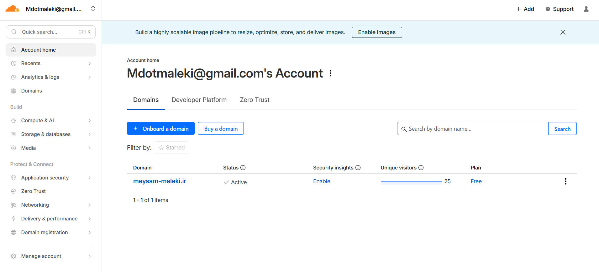
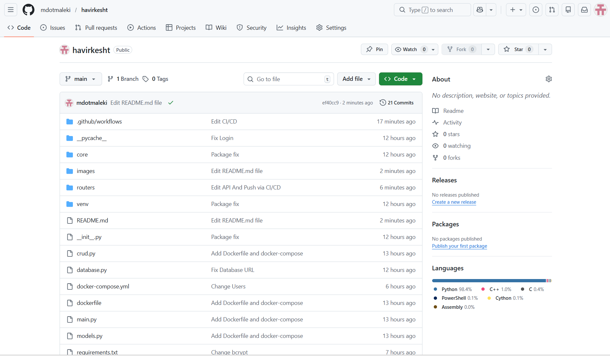
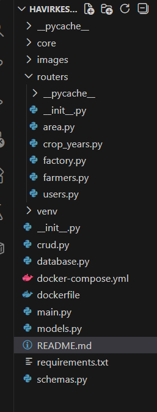

# HAVIRKESHT Backend

پروژه **HAVIRKESHT** یک سرویس بک‌اند مبتنی بر **FastAPI** است که برای مدیریت داده‌های کشاورزی، مناطق، کاربران و عملیات مدیریتی طراحی شده است.  
این سرویس با ساختار ماژولار، امنیت مبتنی بر JWT، و معماری قابل توسعه پیاده‌سازی شده است.

---

## تکنولوژی‌های استفاده‌شده

- **Python 3.10+**
- **FastAPI**
- **Uvicorn**
- **PostgreSQL**
- **SQLAlchemy**
- **Alembic**
- **Pydantic**
- **Nginx**
- **Docker**
- **Cloudflare (SSL + CDN)**

---
## احراز هویت
این پروژه از JWT برای احراز هویت استفاده می‌کند:

ثبت‌نام کاربر

ورود کاربر

دریافت توکن

محافظت از مسیرها با OAuth2PasswordBearer

---

## مستندات پروژه
مستندات API
پس از اجرای پروژه، مستندات خودکار FastAPI در مسیرهای زیر در دسترس هستند:

Swagger UI
https://meysam-maleki.ir/docs

OpenAPI JSON
https://meysam-maleki.ir/openapi.json

---

## مدیریت دامنه با Cloudflare

---

---

## قرار دادن پروژه در Github Repository

---

## نصب وابستگی ها
pip install -r requirements.txt

---

## اجرای سرور توسعه
uvicorn app.main:app --reload

---

##  ساختار کلی پروژه

